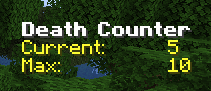
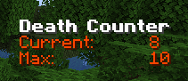
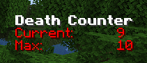
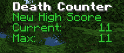

# Death Stats

 A client side mod which tracks deaths over time and provides graphs and additional statistics.

 All rights reserved.

 * Track deaths per session
 * Show number when you die
 * Show if its higher than max session 
 * Hide side menu after specific time of no deaths
 * Command to reshow again for some time
 * Store when max was set
 * Change high score color as you get close to it.  90% 95%?
 * Add fabric support

# Build

```bash
java17
./gradlew genIntellijRuns
./gradlew build
```

# Release 
 * Modrinth
 * github release

# Issues
 * https://github.com/iChun/ContentCreatorIntegration-IssuesAndDocumentation/issues/89
   * https://github.com/MinecraftForge/MinecraftForge/pull/7754 

# Guide

DeathStats tracks users deaths and provides an on screen counter.   
The values are stored in a file in the users home directory.   
E.g. `/home/mnkybrdr` or `C:\Users\mnkybrdr`

## In Game Display


Deaths are shown in white when less than 50% of max



Deaths are shown in yellow when between 50% - 75%



Deaths are shown in orange when between 50% - 75%



Deaths are shown in red when between 90% - 100%



New high score is shown when you are setting the highscore.

## Commands

For the commands run : 
```/deathstats help```

```
DeathStats by mnkybrdr

/deathstats set current <value> - set current value
/deathstats set max <value> - set max value
/deathstats set visible <true|value> - hides or shows the overlay
/deathstats get current - get current value
/deathstats get max - get max value
/deathstats get highscore - has the highscore hit
/deathstats debug - shows debug information
/deathstats sound - plays high score sound
/deathstats reset - sets max and current to 0
```