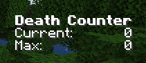

# Death Stats

 A client side mod which tracks deaths over time and provides graphs and additional statistics.

 All rights reserved.

 Its WIP still and currently only tracks a death counter right now and max deaths.
 
 Deaths are tracked (after respawn button is pressed) over time.  
 
You can reset the counter (based on session, twitch stream session, raid, day, month etc) by using the ```/deathstats set current 0```
 If you want to reset everything you can either ```/deathstats set max 0``` and ```/deathstats set current 0```
or ```/deathstats reset```

## TODO
 * Store each death over time and graph it (only for current deaths counter)
 * Add fabric support

## Issues
 * The counter only increments after the user respawns not on the actual death.  This is because the client event for respawn is being used and there isnt one for died.
 * Worked around https://github.com/iChun/ContentCreatorIntegration-IssuesAndDocumentation/issues/89
   * https://github.com/MinecraftForge/MinecraftForge/pull/7754 

## Guide

DeathStats tracks users deaths and provides an on-screen counter.  

The values are stored in a file in the users home directory.   
E.g. `/home/mnkybrdr/minecraft_deaths.dat` or `C:\Users\mnkybrdr\minecraft_deaths.dat`

## In Game Display



Deaths are shown in white when less than 50% of max


Deaths are shown in yellow when between 50% - 75%


Deaths are shown in orange when between 50% - 75%


Deaths are shown in red when between 90% - 100%


New high score is shown when you are setting the highscore.

## Commands

For the commands run : 
```/deathstats help```

```
DeathStats by mnkybrdr

/deathstats set current <value> - set current value
/deathstats set max <value> - set max value
/deathstats set visible <true|value> - hides or shows the overlay
/deathstats get current - get current value
/deathstats get max - get max value
/deathstats get highscore - has the highscore hit
/deathstats debug - shows debug information
/deathstats sound - plays high score sound
/deathstats reset - sets max and current to 0
```

## Build

```bash
java17
./gradlew genIntellijRuns
./gradlew build
```